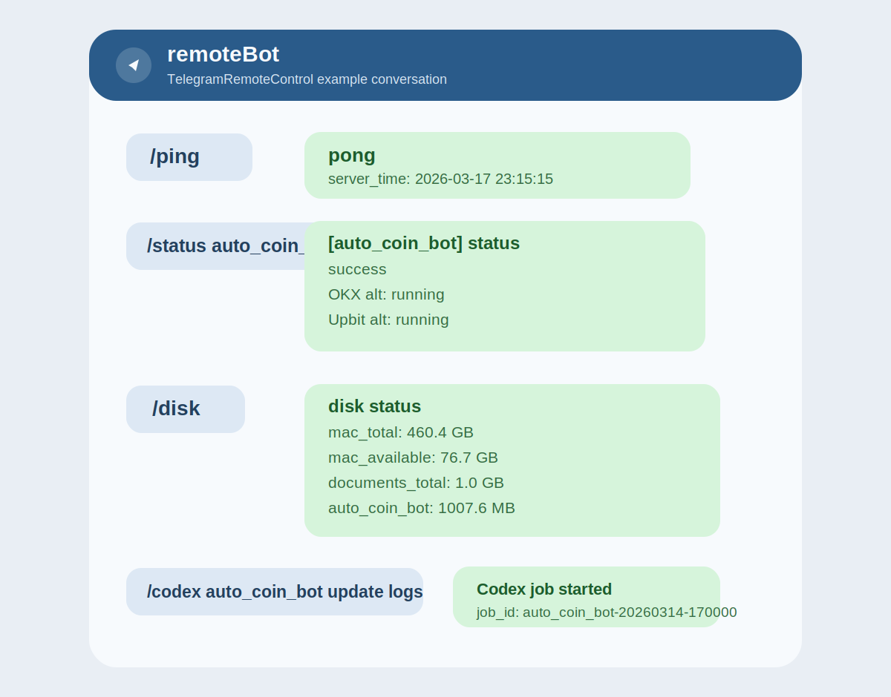
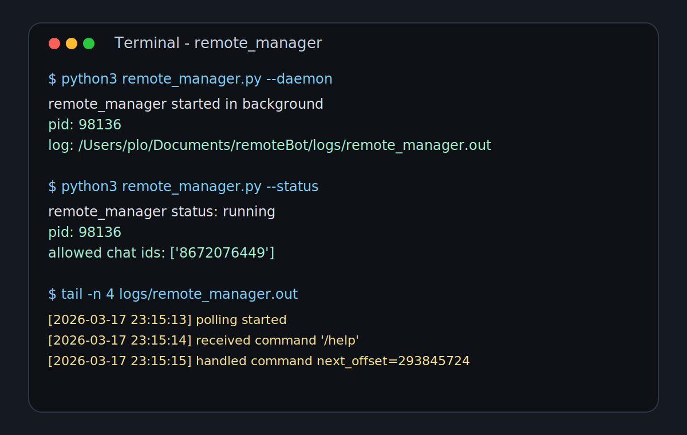

# TelegramRemoteControl

`TelegramRemoteControl`은 텔레그램에서 여러 로컬 프로젝트를 원격 제어하기 위한 공용 매니저입니다.

원격에서 할 수 있는 핵심 일은 두 가지입니다.

- 등록된 프로젝트의 운영 명령을 텔레그램에서 안전하게 실행
- 등록된 프로젝트 경로에서 `codex exec`를 호출해 원격 수정 작업 시작

즉, `auto_coin_bot` 같은 기존 프로젝트뿐 아니라 앞으로 추가될 다른 로컬 프로젝트도 같은 방식으로 한 봇에서 관리할 수 있습니다.

## 한눈에 보기

- 텔레그램 명령으로 프로젝트 상태 확인
- 등록된 시작/중지/점검 명령 실행
- Codex 원격 작업 시작과 결과 확인
- 맥북 상태 조회
  - `/battery`
  - `/wifi`
  - `/disk`
  - `/uptime`

## Screenshots

Telegram command flow example:



Terminal and manager status example:



## 아키텍처

```text
Telegram
  -> remote_manager.py
     -> config/projects.toml 의 허용 프로젝트/명령 확인
     -> 등록된 로컬 프로젝트 명령 실행
     -> 필요하면 codex exec 작업 시작
     -> logs/jobs/<job_id>/ 에 작업 결과 저장
```

## 현재 예시 프로젝트

- `auto_coin_bot`
  - 상태 확인
  - 전체 시작/중지
  - 텔레그램 리스너 시작/중지
- `auto_stock_bot`
  - KIS 연결 확인
  - 현재가 조회 점검

새 프로젝트를 붙일 때는 `config/projects.toml` 에 프로젝트 블록만 추가하면 됩니다.

## 구조

- `remote_manager.py`: 텔레그램 폴링, 프로젝트 명령 실행, Codex 작업 시작
- `config/projects.toml`: 관리 대상 프로젝트와 허용 명령 정의
- `logs/jobs/<job_id>/`: Codex 작업 로그와 마지막 응답 저장
- `scripts/run_remote_manager.sh`: 실행 보조 스크립트
- `launchd/com.plo.remotebot.plist`: macOS launchd 예시 파일

## 보안 원칙

- 허용된 `chat_id` 에서 온 메시지만 처리합니다.
- 임의 셸 명령은 받지 않습니다.
- 프로젝트별로 `config/projects.toml` 에 등록된 명령만 `/run` 으로 실행합니다.
- `/codex` 도 등록된 프로젝트 경로에서만 실행합니다.

## 빠른 시작

1. `.env.example` 을 참고해 `.env` 파일을 만듭니다.
2. `.env` 안의 `REMOTE_BOT_TELEGRAM_BOT_TOKEN` 에 새 텔레그램 봇 토큰을 넣습니다.
3. `config/projects.toml` 의 `allowed_chat_ids` 를 본인 텔레그램 chat id 로 바꿉니다.
4. 필요하면 `projects.<name>` 항목을 추가해 다른 프로젝트를 등록합니다.
5. 아래 명령으로 설정을 먼저 검증합니다.

```bash
python3 remote_manager.py --once
```

6. 문제가 없으면 실행합니다.

```bash
python3 remote_manager.py
```

설정할 때 주의할 점:

- 실제 봇 토큰은 `.env` 에 넣습니다.
- `config/projects.toml` 의 `bot_token_env` 에는 토큰값이 아니라 환경변수 이름인 `REMOTE_BOT_TELEGRAM_BOT_TOKEN` 이 들어가야 합니다.
- `allowed_chat_ids` 는 이 봇을 사용할 텔레그램 사용자 또는 채팅방 id 목록입니다.
- 예시 파일인 `.env.example` 은 안내용이므로 그대로 실행 파일로 쓰지 않습니다.

터미널을 바로 돌려받고 싶으면 백그라운드로 실행할 수 있습니다.

```bash
python3 remote_manager.py --daemon
python3 remote_manager.py --status
python3 remote_manager.py --stop
```

직접 `nohup` 으로 실행하고 싶다면 아래처럼 써도 됩니다.

```bash
nohup python3 /Users/plo/Documents/remoteBot/remote_manager.py > /Users/plo/Documents/remoteBot/logs/remote_manager.out 2>&1 &
```

## 텔레그램 명령

- `/projects`
- `/ping`
- `/test`
- `/battery`
- `/wifi`
- `/disk`
- `/uptime`
- `/manager`
- `/status <project>`
- `/run <project> <command_key>`
- `/codex <project> <요청>`
- `/jobs`
- `/job <job_id>`
- `/help`

예시:

```text
/projects
/ping
/test
/battery
/wifi
/disk
/uptime
/manager
/status auto_coin_bot
/run auto_coin_bot start_all
/codex auto_coin_bot README에 현재 봇 운영 구조를 반영해 정리해줘
/job auto_coin_bot-20260314-170000
```

실무에서 자주 쓰는 흐름:

```text
/manager
/projects
/status auto_coin_bot
/run auto_coin_bot start_all
/codex auto_coin_bot 손절 로그를 더 자세히 남기도록 수정해줘
/job auto_coin_bot-20260314-170000
```

대화 예시:

```text
나: /ping
봇: pong
    server_time: 2026-03-17 23:15:15

나: /status auto_coin_bot
봇: [auto_coin_bot] status
    성공
    OKX 알트: running
    업비트 알트: running
    텔레그램 리스너: running

나: /disk
봇: disk status
    mac_total: 460.4 GB
    mac_available: 76.7 GB
    documents_total: 1.0 GB

나: /codex auto_coin_bot 손절 로그를 더 자세히 남기도록 수정해줘
봇: [auto_coin_bot] Codex 작업을 시작했습니다.
    job_id: auto_coin_bot-20260314-170000
    확인: /job auto_coin_bot-20260314-170000
```

## 새 프로젝트 추가

`config/projects.toml` 에 아래 형태로 프로젝트를 추가하면 됩니다.

```toml
[projects.my_project]
path = "/Users/plo/Documents/my_project"
description = "설명"

[projects.my_project.commands]
status = "python3 app.py --status"
restart = "./scripts/restart.sh"

[projects.my_project.codex]
sandbox = "workspace-write"
timeout_sec = 1200
add_dirs = []
skip_git_repo_check = false
```

## launchd 실행

macOS에서 로그인 후 자동으로 `remote_manager`를 띄우고 싶다면 `launchd`를 사용할 수 있습니다.

기본 예시 파일:

- `launchd/com.plo.remotebot.plist`

등록 예시:

```bash
mkdir -p ~/Library/LaunchAgents
cp launchd/com.plo.remotebot.plist ~/Library/LaunchAgents/
launchctl unload ~/Library/LaunchAgents/com.plo.remotebot.plist 2>/dev/null || true
launchctl load ~/Library/LaunchAgents/com.plo.remotebot.plist
launchctl start com.plo.remotebot
```

상태 확인과 해제:

```bash
launchctl list | grep remotebot
launchctl stop com.plo.remotebot
launchctl unload ~/Library/LaunchAgents/com.plo.remotebot.plist
```

`plist` 안의 Python 경로, 작업 경로, 로그 경로는 자신의 환경에 맞게 확인하는 것이 안전합니다.

## 보안 체크리스트

- `.env` 파일은 Git에 올리지 않습니다.
- `allowed_chat_ids` 에 본인 또는 허용된 채팅방 id만 넣습니다.
- `config/projects.toml` 에는 꼭 필요한 명령만 등록합니다.
- `/run` 으로 임의 셸 명령을 받지 않도록 현재 구조를 유지합니다.
- Telegram 봇 토큰이 노출되면 즉시 BotFather에서 재발급합니다.
- `codex exec` 대상 프로젝트에는 민감한 파일이 있는지 먼저 확인합니다.
- 맥북 상태 명령과 프로젝트 제어 명령은 개인 봇 또는 제한된 채팅에서만 사용하는 것을 권장합니다.

## 운영 메모

- `codex exec` 는 비동기로 시작되고, 결과는 `logs/jobs/<job_id>/last_message.txt` 에 저장됩니다.
- 텔레그램에서는 `/job <job_id>` 로 마지막 응답과 현재 상태를 확인할 수 있습니다.
- `auto_coin_bot`처럼 별도 텔레그램 리스너가 있는 프로젝트도 이 매니저와 병행할 수 있습니다.
